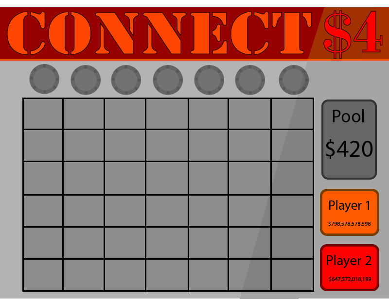

#  -- AS91637 --

#### Develop a complex computer program for a specified task

## Brief

A probability based game i.e. Blackjack, Poker. A running total for bids, and the players names must be held for returning play. The GUI should involve images if it is a card game and follow the rules of the game according to a quoted source. When a player is broke play must stop. New players can be added via an administration screen

## Plan

The program will be developed in Python 3.5, using Pythons IDLE, and the GitHub developed Atom IDE

* **Specifications**
* 7x6 Grid
* Computer player with 'understanding' of game board, that can plan ahead and such.
* Ability to save players, and their monetary values.
* Computer will always start with $420, so a player can play it forever.
* Ability to create new players, so that multiple people can play, and if one becomes bankrupt, they can start again.
* Both against computer and player v player.

### Program Structure

##### Table of Classes

Class | Function
--- | ---
Player | Holds player information
Window | Creates the playing window
Game | Holds all game logic
CompLogic | Holds the logic for the computer player

#### GUI

##### Program View Concept

##### Event handling:
* Player input for what row they play on
* User input for changing current players, and creating new players.

### Game Design

Gambling Connect 4. Each piece a player plays is a certain number of currency, person who wins gets it all. The rest is normal connect 4

Each player will start with $1000. Each play costs $10, which will go into the pool. When a player has connected 4 'pieces', they will get all the money in the pool. A tie will result in both players getting 1/4 of the money, with the rest being lost to both players.

### Schedule

 Date | Action
 --- | ---
 14/05/18| Talk with Client to discuss brief
 16/05/18 | Plan the program
 18/05/18 | Talk to Client, pitch plan, change based on feedback
 21/05/18 | Start to create program
 8/06/18 | Final meeting with Client for QA, and then make changes based on the testing
